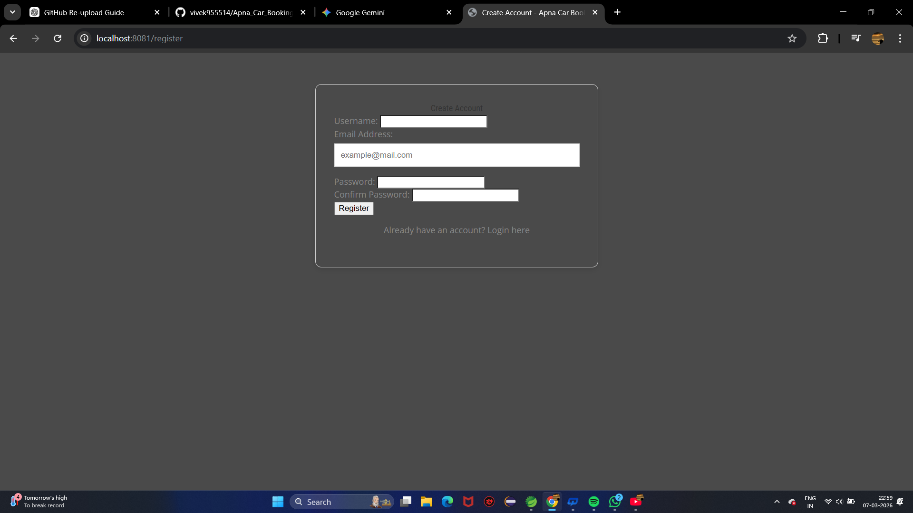
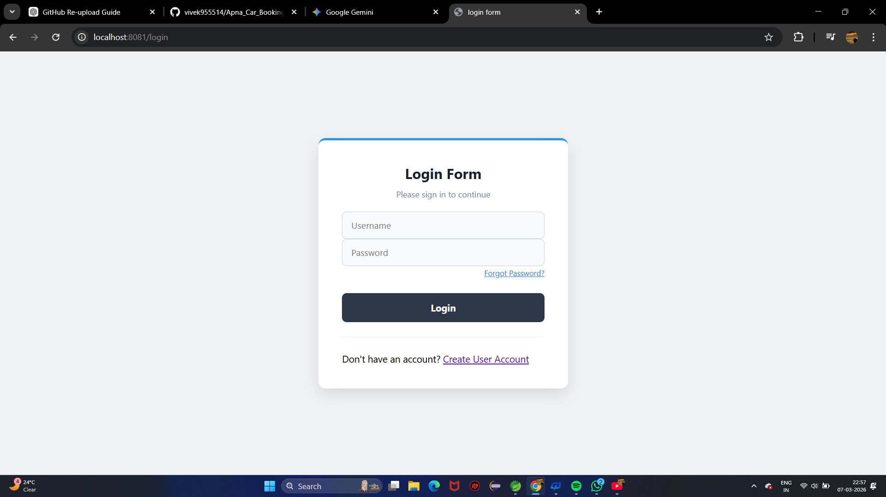
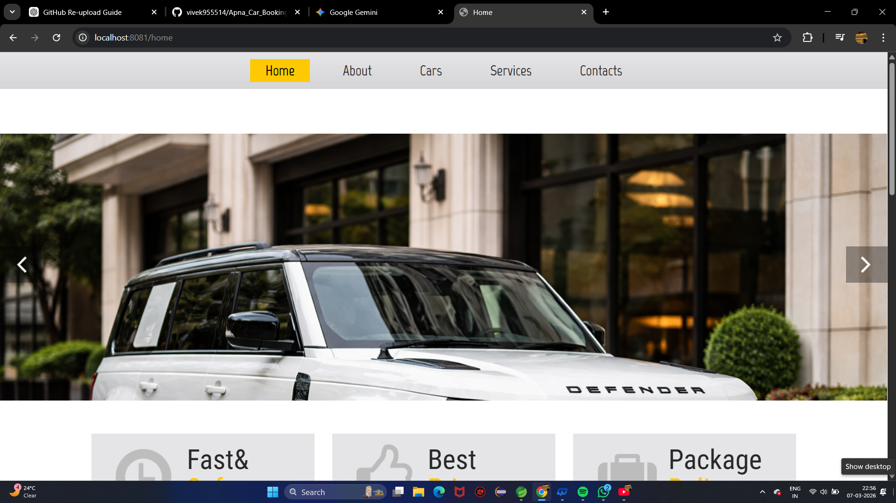
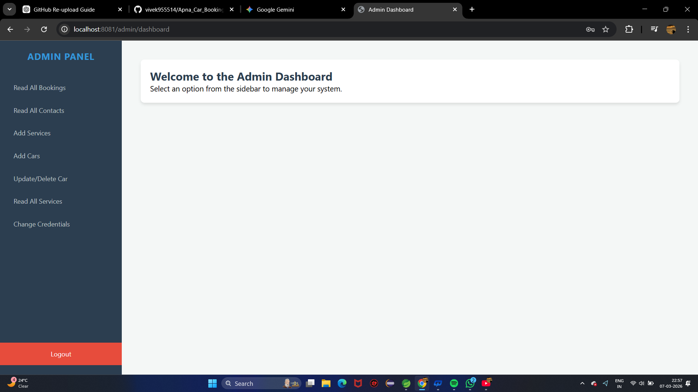
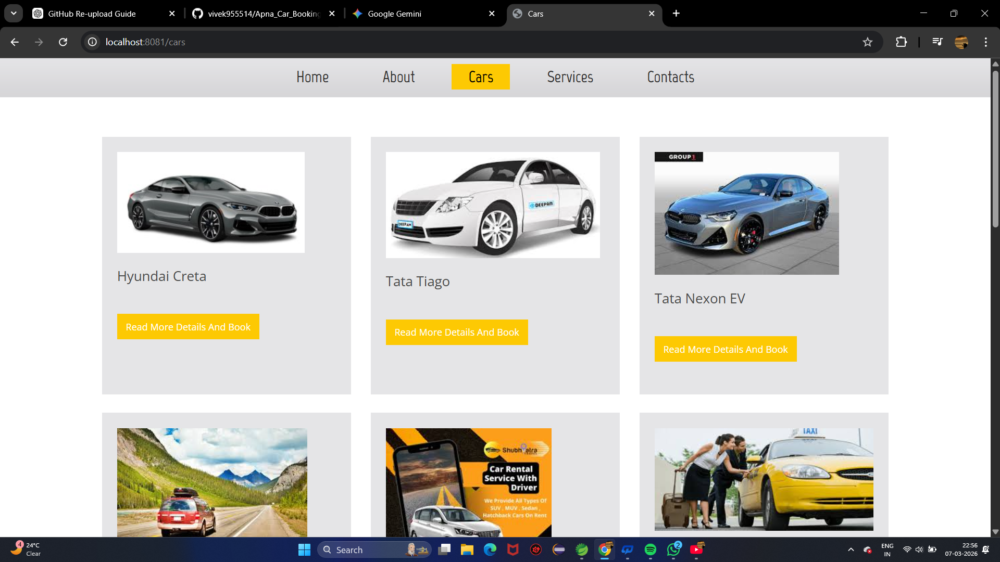
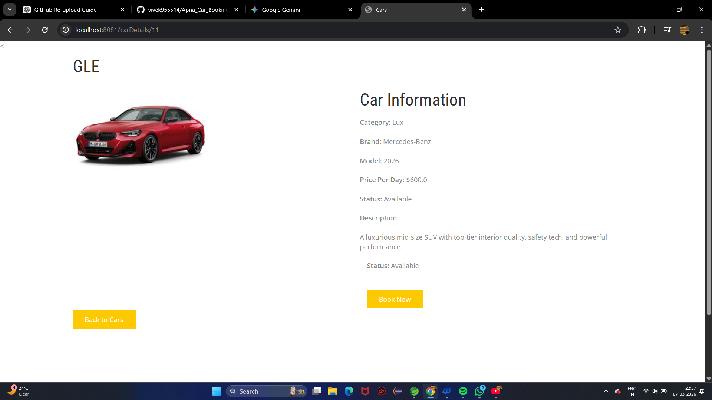
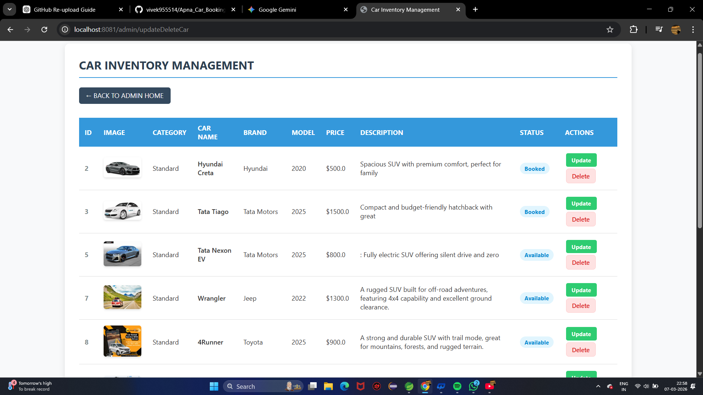

# 🚗 Apna Car Booking App

**Apna Car Booking App** is a full-stack web application built using the **Spring Boot ecosystem** that allows users to browse available cars, book cars online, and manage their bookings easily.  

The system provides **secure authentication, car inventory management, booking management, and an admin dashboard** for efficient control of the platform.

This project demonstrates practical implementation of **Java backend development using Spring Boot, Spring MVC, Spring Security, and Spring Data JPA with MySQL**, along with a responsive user interface built using **Thymeleaf, HTML, and CSS**.

The application also includes features such as **email notifications, password recovery via email, booking confirmation, and cancellation functionality**, making it a complete end-to-end car booking solution.

---

## ✨ Features

### 🔐 Authentication & Security
- Secure **User Registration and Login** using Spring Security  
- **Change Password via Email Verification**
- Role-based access for **Users and Admin**

### 🚗 Car Booking System
- Browse and view **available cars**
- **Book cars online**
- **Cancel booked cars**
- **Email confirmation after booking**

### 📊 Admin Dashboard
- Manage **car inventory**
- **Add new cars**
- **Add new services**
- View and manage **all bookings**
- Manage platform services

### 📧 Communication & Support
- **Contact Form for customer inquiries**
- **Email notifications for bookings**
- **Customer inquiry management**

### ⚙️ Management Features
- Car Inventory Management
- Service Management
- Booking Management
- Contact Inquiry Management

---

## 📸 Application Screenshots
### Registration Page

### Login Page

### Home Page

### admin Page

### Car Listing Page

### Booking Page

### Booking Page

###  Car Inventory Management Page

---

## 🛠 Technologies Used

| Technology | Purpose |
|------------|---------|
| Java | Backend Development |
| Spring Boot | Application Framework |
| Spring MVC | Web Application Architecture |
| Spring Security | Authentication & Authorization |
| Spring Data JPA | Database Access Layer |
| Hibernate | ORM Framework |
| MySQL | Relational Database |
| Thymeleaf | Server-side Template Engine |
| HTML | Page Structure |
| CSS | UI Styling |

---

## 📂 Project Structure

Apna_Car_Booking_App
│
├── src/main/java
│ ├── controller
│ ├── service
│ ├── repository
│ └── model
│
├── src/main/resources
│ ├── templates
│ ├── static
│ └── application.properties
│
├── screenshots
│
├── pom.xml
└── README.md

---

## 👨‍💻 Author

**Vivek Kumar Rai**

- Java Developer  
- Spring Boot Developer  

---

## 📄 License

This project is developed for **learning and demonstration purposes**.
